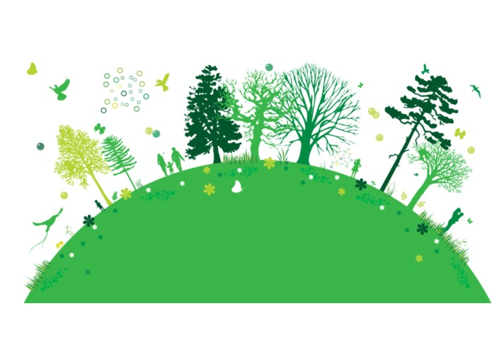

# GreenLife

## An app that generates a users green score according to its consumption of utilities such as Electricity, Water & Gas

## Summary

<h5>Inspiration</h5>
In today's world of evergrowing demand for energy, there is a need for a platform that will incentivize people to live more energy efficient lives.

<h5>What it does</h5>
You take a picture of your utility bill and the platform assigns a Green Score after scanning and analyzing your utility bill.

<h5>How we built it</h5>
We built an android application, integrated it with Google Cloud Vision API for performing OCR, the application computes a score after analyzing the text. We have also made use of Facebook Graph API to make the App social. Users can compete with friends who make use of the app as well.

<h5>What we learned</h5>
We learnt how to use the Facebook's Graph API and Google Cloud Vision API. We learnt how to handle JSON data in Android.

<h5>What's next for GreenLife</h5>
We plan to incorporate a mechanism where people can make donations/trades using their eco-scores and hope to make it a virtual currency.

<h5>Built With</h5>
android, java, facebook-graph, facebook-login-api, facebook

## Copyright

This work and the name 'GreenLife' is licensed under a [Creative Commons Attribution-NonCommercial-NoDerivatives 4.0 International License](http://creativecommons.org/licenses/by-nc-nd/4.0/)
